# Execution Plan

## Detailed Analysis Summary

### Change Impact Assessment
- **User-facing changes**: Yes — entirely new platform with learner, admin, and reviewer interfaces
- **Structural changes**: Yes — new multi-agent architecture, new API layer, new frontend
- **Data model changes**: Yes — new DynamoDB tables for users, curricula, content, progress, credentials
- **API changes**: Yes — new REST API (FastAPI) with endpoints for all platform features
- **NFR impact**: Yes — performance (AI generation latency), security (auth, data privacy), scalability (serverless)

### Risk Assessment
- **Risk Level**: Medium — new greenfield project with well-defined tech stack, but complex AI agent orchestration
- **Rollback Complexity**: Easy — greenfield, no existing system to break
- **Testing Complexity**: Complex — multi-agent interactions, AI content quality, adaptive learning paths

## Workflow Visualization

```mermaid
flowchart TD
    Start(["User Request"])
    
    subgraph INCEPTION["INCEPTION PHASE"]
        WD["Workspace Detection<br/><b>COMPLETED</b>"]
        RA["Requirements Analysis<br/><b>COMPLETED</b>"]
        US["User Stories<br/><b>COMPLETED</b>"]
        WP["Workflow Planning<br/><b>COMPLETED</b>"]
        AD["Application Design<br/><b>EXECUTE</b>"]
        UG["Units Generation<br/><b>EXECUTE</b>"]
    end
    
    subgraph CONSTRUCTION["CONSTRUCTION PHASE"]
        FD["Functional Design<br/><b>EXECUTE per unit</b>"]
        NFRA["NFR Requirements<br/><b>EXECUTE per unit</b>"]
        NFRD["NFR Design<br/><b>EXECUTE per unit</b>"]
        ID["Infrastructure Design<br/><b>EXECUTE per unit</b>"]
        CG["Code Generation<br/><b>EXECUTE per unit</b>"]
        BT["Build and Test<br/><b>EXECUTE</b>"]
    end
    
    subgraph OPERATIONS["OPERATIONS PHASE"]
        OPS["Operations<br/><b>PLACEHOLDER</b>"]
    end
    
    Start --> WD
    WD --> RA
    RA --> US
    US --> WP
    WP --> AD
    AD --> UG
    UG --> FD
    FD --> NFRA
    NFRA --> NFRD
    NFRD --> ID
    ID --> CG
    CG --> BT
    BT --> OPS
    OPS --> End(["Complete"])

    style WD fill:#4CAF50,stroke:#1B5E20,stroke-width:3px,color:#fff
    style RA fill:#4CAF50,stroke:#1B5E20,stroke-width:3px,color:#fff
    style US fill:#4CAF50,stroke:#1B5E20,stroke-width:3px,color:#fff
    style WP fill:#4CAF50,stroke:#1B5E20,stroke-width:3px,color:#fff
    style AD fill:#FFA726,stroke:#E65100,stroke-width:3px,stroke-dasharray: 5 5,color:#000
    style UG fill:#FFA726,stroke:#E65100,stroke-width:3px,stroke-dasharray: 5 5,color:#000
    style FD fill:#FFA726,stroke:#E65100,stroke-width:3px,stroke-dasharray: 5 5,color:#000
    style NFRA fill:#FFA726,stroke:#E65100,stroke-width:3px,stroke-dasharray: 5 5,color:#000
    style NFRD fill:#FFA726,stroke:#E65100,stroke-width:3px,stroke-dasharray: 5 5,color:#000
    style ID fill:#FFA726,stroke:#E65100,stroke-width:3px,stroke-dasharray: 5 5,color:#000
    style CG fill:#4CAF50,stroke:#1B5E20,stroke-width:3px,color:#fff
    style BT fill:#4CAF50,stroke:#1B5E20,stroke-width:3px,color:#fff
    style OPS fill:#BDBDBD,stroke:#424242,stroke-width:2px,stroke-dasharray: 5 5,color:#000
    style Start fill:#CE93D8,stroke:#6A1B9A,stroke-width:3px,color:#000
    style End fill:#CE93D8,stroke:#6A1B9A,stroke-width:3px,color:#000
    style INCEPTION fill:#BBDEFB,stroke:#1565C0,stroke-width:2px
    style CONSTRUCTION fill:#C8E6C9,stroke:#2E7D32,stroke-width:2px
    style OPERATIONS fill:#FFF59D,stroke:#F9A825,stroke-width:2px
    linkStyle default stroke:#333,stroke-width:2px
```



### Text Alternative
```
Phase 1: INCEPTION
  - Workspace Detection (COMPLETED)
  - Requirements Analysis (COMPLETED)
  - User Stories (COMPLETED)
  - Workflow Planning (COMPLETED)
  - Application Design (EXECUTE)
  - Units Generation (EXECUTE)

Phase 2: CONSTRUCTION (per unit)
  - Functional Design (EXECUTE)
  - NFR Requirements (EXECUTE)
  - NFR Design (EXECUTE)
  - Infrastructure Design (EXECUTE)
  - Code Generation (EXECUTE)
  - Build and Test (EXECUTE)

Phase 3: OPERATIONS
  - Operations (PLACEHOLDER)
```

## Phases to Execute

### INCEPTION PHASE
- [x] Workspace Detection - COMPLETED
- [x] Reverse Engineering - SKIPPED (Greenfield)
- [x] Requirements Analysis - COMPLETED
- [x] User Stories - COMPLETED
- [x] Workflow Planning - IN PROGRESS
- [ ] Application Design - EXECUTE
  - **Rationale**: Complex multi-agent system requires component design — 6 agents, API layer, frontend, data models, and inter-agent communication patterns all need definition before implementation
- [ ] Units Generation - EXECUTE
  - **Rationale**: System decomposes into multiple independent units (agents, API, frontend, infrastructure) that benefit from structured breakdown for parallel development

### CONSTRUCTION PHASE (per unit)
- [ ] Functional Design - EXECUTE
  - **Rationale**: Each unit has complex business logic — agent orchestration, adaptive testing algorithms, content generation pipelines, credential issuance workflows
- [ ] NFR Requirements - EXECUTE
  - **Rationale**: Performance (AI latency), security (auth, OAuth, data privacy), scalability (serverless auto-scaling), and cost optimisation all need explicit requirements
- [ ] NFR Design - EXECUTE
  - **Rationale**: NFR patterns need to be incorporated into each unit — caching strategies, retry policies, token management, streaming responses
- [ ] Infrastructure Design - EXECUTE
  - **Rationale**: Serverless architecture (Lambda, API Gateway, DynamoDB, Bedrock) needs explicit infrastructure mapping per unit
- [ ] Code Generation - EXECUTE (ALWAYS)
  - **Rationale**: Implementation of all units
- [ ] Build and Test - EXECUTE (ALWAYS)
  - **Rationale**: Build verification, unit tests, integration tests, agent interaction tests

### OPERATIONS PHASE
- [ ] Operations - PLACEHOLDER

## Success Criteria
- **Primary Goal**: Working MVP with multi-agent curriculum generation, content creation, quizzes, adaptive learning, and admin dashboard
- **Key Deliverables**:
  - Python FastAPI backend with Strands Agents SDK integration
  - React + Vite + Tailwind + ShadCN frontend
  - 5 AI agents (Orchestrator, Research, Content, Assessment, Personalisation)
  - AgentCore memory for learner context persistence
  - DynamoDB data layer
  - Serverless infrastructure (Lambda, API Gateway)
  - Content review workflow (AWS Responsible AI compliance)
  - Admin dashboard with learner progress tracking
- **Quality Gates**:
  - All agents generate content that passes review workflow
  - Adaptive learning paths adjust based on pre-assessment
  - Quiz difficulty adapts to learner performance
  - Content review blocks unpublished content from learners
